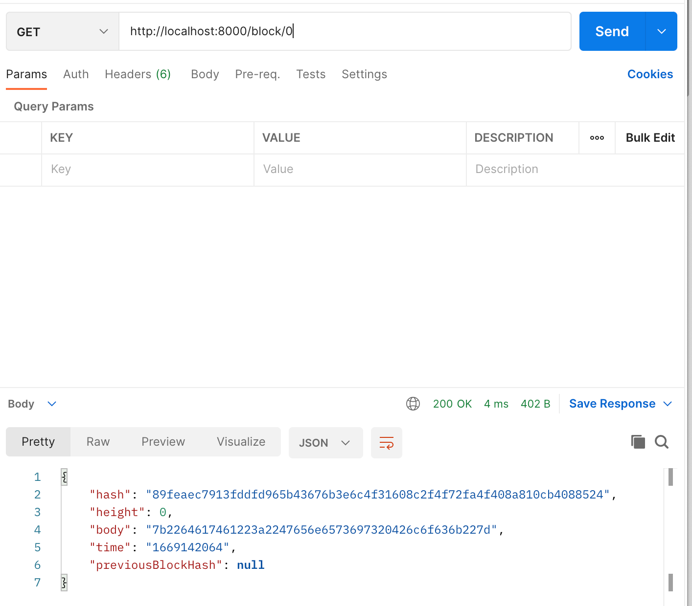
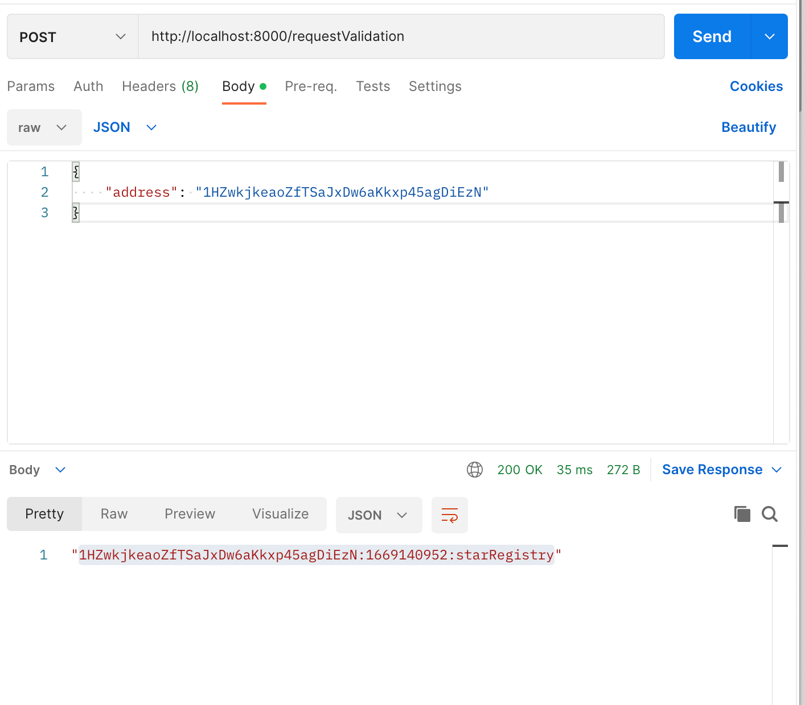
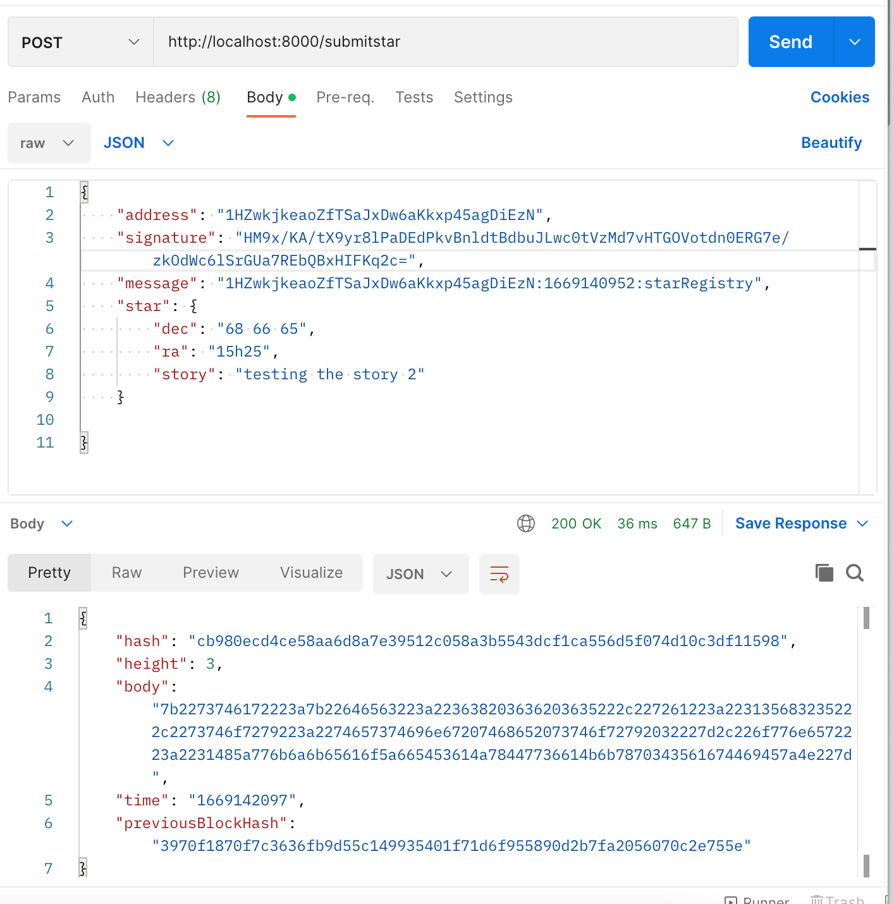
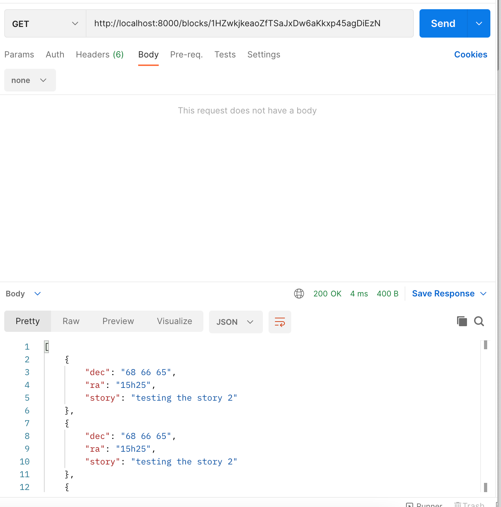
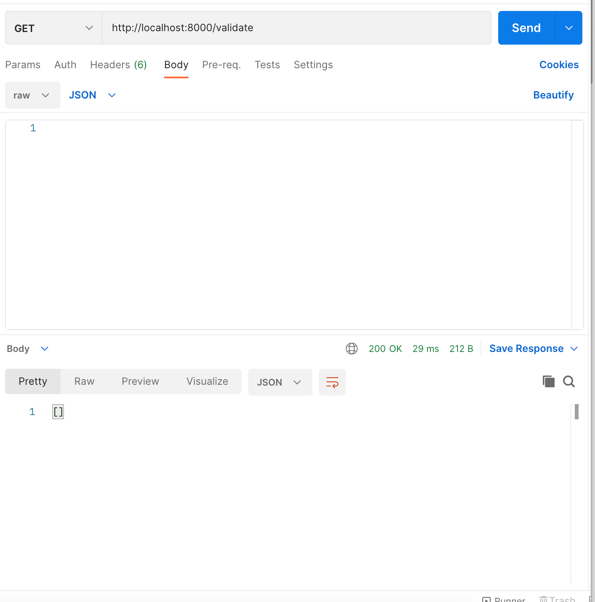

# Create your own private blockchain

## Use case

A group of astronomy fans want to create an application that allows them to register stars, and track the ownership of each. This solution uses a blockchain system to achieve those goals.
We'll use a Bitcoin wallet to sign with our private key when registering a star.

## Installation

Clone the repository and then:
`npm install`

Then lauch the server on localhost://8000
`node app.js`

## Test the app

The application provides a REST API for user interaction.
A simple way to interact is with <a href="https://www.postman.com/">Postman</a>

Endpoints: 

### Retrieve a block information:
http://localhost:8000/block/{blockNumber}

### Request ownership of a start
http://localhost:8000/requestValidation
In the body, place your public Bitcoin address
The API will return a timestamped message

### Submit a star
http://localhost:8000/submitstar
Fill the body with this information:
- "address": your Bitcoin public address
- "signature": the timestamped message signed with your private key
- "message": the timestamped message
- "star": the star characteristics that you want to register

### Retrieve stars owned by me
http://localhost:8000/blocks/{yourBitcoinPublicAddress}
This provide the list of stars own by the Bitcoin public address

### Validate chain
http://localhost:8000/validate

This validates the chain has not been tempered:
- all block hashes are correct
- the previous hash of a block is the hash of the previous block
it returns the list of errors in an array

## License

The MIT License (MIT)

Copyright (c) 2015 Chris Kibble

Permission is hereby granted, free of charge, to any person obtaining a copy of this software and associated documentation files (the "Software"), to deal in the Software without restriction, including without limitation the rights to use, copy, modify, merge, publish, distribute, sublicense, and/or sell copies of the Software, and to permit persons to whom the Software is furnished to do so, subject to the following conditions:

The above copyright notice and this permission notice shall be included in all copies or substantial portions of the Software.

THE SOFTWARE IS PROVIDED "AS IS", WITHOUT WARRANTY OF ANY KIND, EXPRESS OR IMPLIED, INCLUDING BUT NOT LIMITED TO THE WARRANTIES OF MERCHANTABILITY, FITNESS FOR A PARTICULAR PURPOSE AND NONINFRINGEMENT. IN NO EVENT SHALL THE AUTHORS OR COPYRIGHT HOLDERS BE LIABLE FOR ANY CLAIM, DAMAGES OR OTHER LIABILITY, WHETHER IN AN ACTION OF CONTRACT, TORT OR OTHERWISE, ARISING FROM, OUT OF OR IN CONNECTION WITH THE SOFTWARE OR THE USE OR OTHER DEALINGS IN THE SOFTWARE.

 

